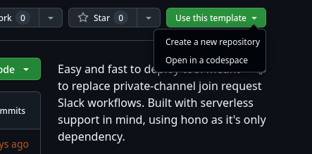
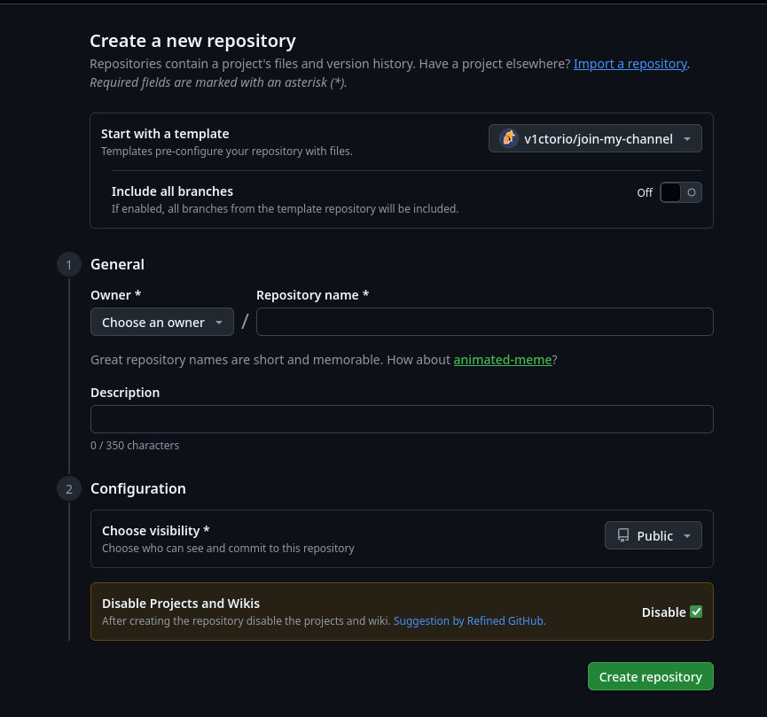
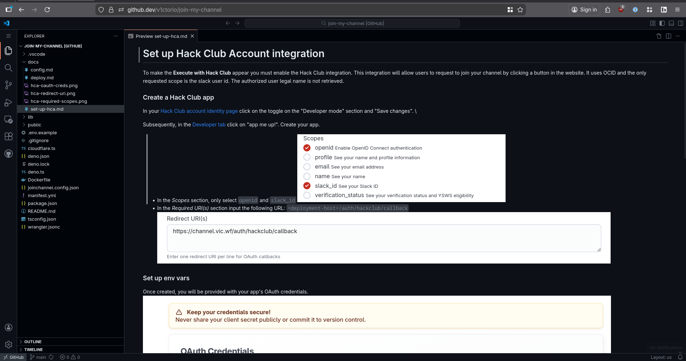

# Deploy

Deploying join-my-channel is easy. There are only two requirements: having a GitHub account and a domain managed at Cloudflare.

## Set up GitHub repo

The first step is to create your own github repo using this template.
1. On the repository [root page](https://github.com/v1ctorio/join-my-channel), click on "Use this template" -> 'Create a new repository'

2. Click on "Create repository" in the bottom right. The visibility or name does not matter.

3. Populate the configuration \
You can do this step from the GitHub web UI, but it will be easier using a code editor. To open vscode web instantly from the project root just click on the dot (`.`) key while on your repo page.

Here you have to update two files: 
- `joinchannel.config.json` - Follow the guide at [docs/config.md](./config.md)
- `manifest.yml` - Follow the comments in the file

If you want to set up the Hack Club account integration right now, follow the guide [set-up.hca.md](./set-up-hca.md)
## Set up the slack app

1. Go to the 'Your Apps' [page in the slack website](https://api.slack.com/apps/). Click 'Create New App' and 'From a manifest'. When asked for a manifest, pick YAML and copy and paste your `manifest.yml` earlier modified.
2. Save your 'Signing Secret'.
3. Install the app to your workspace and save the provided 'Bot User OAuth Token' (should start with `xoxb-`).

## Create your worker

1. In your [Cloudflare dashboard](https://dash.cloudflare.com/), navigate to Compute & AI > Workers & Pages. Click on 'Create Application'.
2. 'Continue with GitHub' and authenticate, pick your modified repo. Proceed with the defaults and click on 'Create'.
3. The first deployment will fail. Input your secrets in  Settings > Variables and Secrets. You can read all the secrets names in the [.env.example](/.env.example).