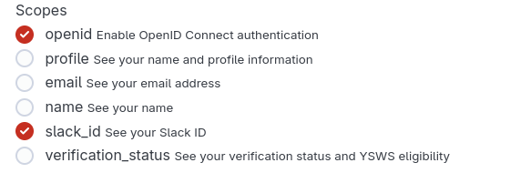
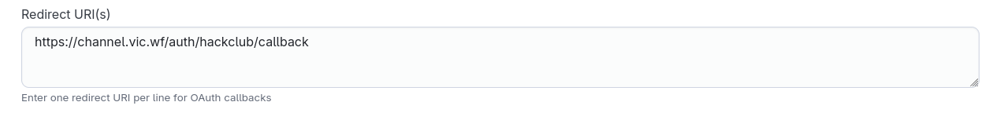

# Set up Hack Club Account integration

To make the **Execute with Hack Club** appear you must enable the Hack Club integration. This integration will allow users to request to join your channel by clicking a button in the website. It uses OCID and the only requested scope is the slack user id. The authorized user legal name is not retrieved.

### Create a Hack Club app
In your [Hack Club account identity page](https://auth.hackclub.com/identity/edit) click on the toggle on the "Developer mode" section and "Save changes". \

Subsequently, in the [Developer tab](https://auth.hackclub.com/developer/apps) click on "app me up!". Create your app. 

- In the *Scopes* section, only select `openid` and `slack_id`

- In the *Required URI(s)* section input the following URL: `<deployment-host>/auth/hackclub/callback`

### Set up env vars
Once created, you will be provided with your app's OAuth credentials. 

Now, add the secrets as their respective environment variables to your deployment: `HCA_CLIENT_SECRET`, `HCA_CLIENT_ID`, `HCA_REDIRECT_URI`.

- For **deno**, add them to your `.env`
- For **Cloudflare Workers**, add them through the [cloudflare dashboard](https://developers.cloudflare.com/workers/configuration/environment-variables/). [Workers & Pages >  *\<worker\>* > Settings > Variables and Secrets]